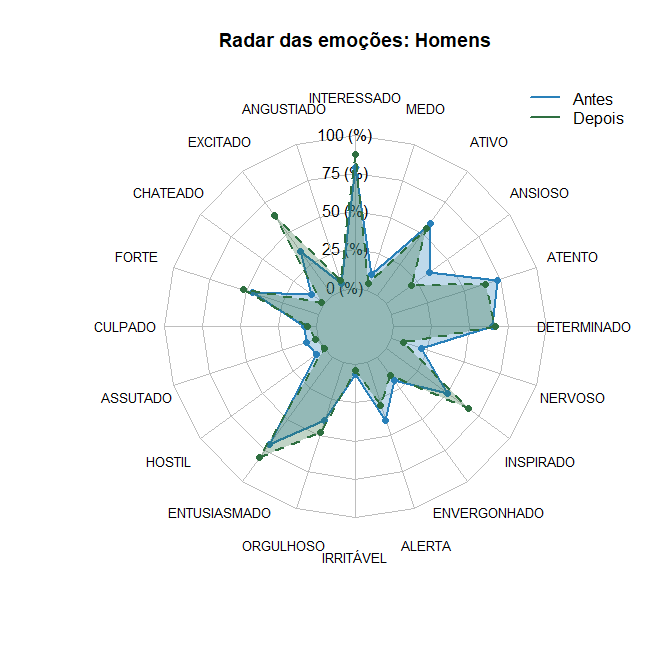

```{r setup, include=FALSE}
library(haven)
library(data.table)
library(lawstat)
library(BSDA)
library(dplyr)
library(ggplot2)
library(factoextra)
library(cluster)
library(fmsb)
library(dplyr)
library(stringi)
library(kableExtra)
library(scales)
library(fmsb)
library(dplyr)
library(stringi)


setwd("C:/Users/55229/Desktop/consultoria/kairo_emocoes_turismo")
data<-read_sav("tabulação dados tese efeito uau.sav")


```


## 1 - Análises Descritivas Iniciais (Sexo, Idade e Lateralização)

```{r, message=FALSE, echo=FALSE, fig.align='center', fig.width=3, fig.height=3}

# ANALISE EXPLORATORIA ---------------------------------------------------------

# SEXO -------------------------------------------------------------------------
dt<-as.data.table(data)

dt <- dt %>%
  mutate(SEXO = as_factor(SEXO))

dt <- dt %>%
  mutate(SEXO = case_when(
    as.numeric(SEXO) == 1 ~ "Masculino",
    as.numeric(SEXO) == 2 ~ "Feminino"
  ))


# Contar e calcular proporções
df_summary <- dt %>%
  count(SEXO) %>%
  mutate(percent = n / sum(n) * 100,
         label = paste0(SEXO, " (", round(percent, 1), "%)"))

# Gráfico de anel (donut)
ggplot(df_summary, aes(x = 2, y = percent, fill = SEXO)) +
  geom_col(width = 1, color = "white") +
  coord_polar(theta = "y") +
  xlim(0.5, 2.5) +  # cria o "buraco"
  theme_void() +
  geom_text(aes(label = label), position = position_stack(vjust = 0.5), fontface="bold") +
  labs(title = "Participantes por Sexo") +
  theme(plot.title = element_text(hjust=0.5,face = "bold"))+
  scale_fill_manual(values = c("Feminino" = '#C5ACCF', "Masculino" = '#BED197')) +
  theme(legend.position = "none")


dt[,.N,by="SEXO"] %>%
  kable() %>%
  kable_styling(font_size = 14)

```


```{r, message=FALSE, echo=FALSE, fig.align='center', fig.width=3, fig.height=3}

# IDADE -------------------------------------------------------------------------

dt <- dt %>%
  mutate(IDADE = as_factor(IDADE))

dt <- dt %>%
  mutate(IDADE = case_when(
    as.numeric(IDADE) == 1 ~ "jovem adulto",
    as.numeric(IDADE) == 2 ~ "meia idade"
  ))


# Contar e calcular proporções
df_summary <- dt %>%
  count(IDADE) %>%
  mutate(percent = n / sum(n) * 100,
         label = paste0(IDADE, " (", round(percent, 1), "%)"))

# Gráfico de anel (donut)
ggplot(df_summary, aes(x = 2, y = percent, fill = IDADE)) +
  geom_col(width = 1, color = "white") +
  coord_polar(theta = "y") +
  xlim(0.5, 2.5) +  # cria o "buraco"
  theme_void() +
  geom_text(aes(label = label), position = position_stack(vjust = 0.5), fontface="bold") +
  labs(title = "Participantes por Idade") +
  theme(plot.title = element_text(hjust=0.5,face = "bold"))+
    scale_fill_manual(values = c("jovem adulto" = '#f6d3bd', "meia idade" = '#DE8971')) +
  theme(legend.position = "none")


dt[,.N,by="IDADE"] %>%
  kable() %>%
  kable_styling(font_size = 14)


```
```{r, message=FALSE, echo=FALSE, fig.align='center', fig.width=3, fig.height=3}

# LATERALIZACAO ----------------------------------------------------------------

dt <- dt %>%
  mutate(`LATERALIZAÇÃO` = as_factor(`LATERALIZAÇÃO`))

dt <- dt %>%
  mutate(`LATERALIZAÇÃO` = case_when(
    as.numeric(`LATERALIZAÇÃO`) == 1 ~ "destro",
    as.numeric(`LATERALIZAÇÃO`) == 2 ~ "canhoto"
  ))


# Contar e calcular proporções
df_summary <- dt %>%
  count(`LATERALIZAÇÃO`) %>%
  mutate(percent = n / sum(n) * 100,
         label = paste0(`LATERALIZAÇÃO`, " (", round(percent, 1), "%)"))

# Gráfico de anel (donut)
ggplot(df_summary, aes(x = 2, y = percent, fill = `LATERALIZAÇÃO`)) +
  geom_col(width = 1, color = "white") +
  coord_polar(theta = "y") +
  xlim(0.5, 2.5) +  # cria o "buraco"
  theme_void() +
  geom_text(aes(label = label), position = position_stack(vjust = 0.5), fontface="bold") +
  labs(title = "Participantes por Lat.") +
  theme(plot.title = element_text(hjust=0.5,face = "bold"))+
    scale_fill_manual(values = c("destro" = '#C9D5DB', "canhoto" = '#9FB5C4')) +
  theme(legend.position = "none")


dt[,.N,by="LATERALIZAÇÃO"] %>%
  kable() %>%
  kable_styling(font_size = 14)


```


```{r, message=FALSE, echo=FALSE, fig.align='center', fig.width=3, fig.height=3}

# PROPORCOES DE SEXO DENTRO DE IDADE -------------------------------------------

df_summary <- dt %>%
  group_by(IDADE, SEXO) %>%
  summarise(n = n(), .groups = "drop") %>%
  group_by(IDADE) %>%
  mutate(prop = n / sum(n),
         label = paste0(round(prop * 100), "%"))  # cria rótulo de porcentagem


ggplot(df_summary, aes(x = IDADE, y = prop, fill = SEXO)) +
  geom_bar(stat = "identity", position = "stack", color = "white") +
  geom_text(aes(label = label), 
            position = position_stack(vjust = 0.5), 
            color = "black", fontface = "bold", size = 4) +
  scale_y_continuous(labels = percent_format(accuracy = 1), 
                     breaks = seq(0, 1, 0.2),
                     expand = expansion(mult = c(0, 0.05))) +
  labs(
    title = "Sexo em Faixa Etária",
    x = NULL,
    y = NULL,
    fill = "Sexo"
  ) +
  scale_fill_manual(
    values = c("Feminino" = "#C5ACCF", "Masculino" = "#BED197")
  ) +
  theme_minimal() +
  theme(
    plot.title = element_text(hjust = 0.5, face = "bold", size = 14),
    axis.title = NULL,
    axis.text = element_text(face = "bold"),
    axis.text.x = element_text(angle = 45, hjust = 1)
    #legend.title = element_text(),
    #legend.text = element_text(face = "bold")
  )

dt[,.N,keyby=.(SEXO,IDADE)] %>%
  kable() %>%
  kable_styling(font_size = 14)


```


```{r, message=FALSE, echo=FALSE, fig.align='center', fig.width=3, fig.height=3}

# PROPORCOES DE LATERALIDADE DENTRO DE IDADE -----------------------------------

df_summary <- dt %>%
  group_by(`LATERALIZAÇÃO`, SEXO) %>%
  summarise(n = n(), .groups = "drop") %>%
  group_by(`LATERALIZAÇÃO`) %>%
  mutate(prop = n / sum(n),
         label = paste0(round(prop * 100), "%"))  # cria rótulo de porcentagem


ggplot(df_summary, aes(x = `LATERALIZAÇÃO`, y = prop, fill = SEXO)) +
  geom_bar(stat = "identity", position = "stack", color = "white") +
  geom_text(aes(label = label), 
            position = position_stack(vjust = 0.5), 
            color = "black", fontface = "bold", size = 4) +
  scale_y_continuous(labels = percent_format(accuracy = 1), 
                     breaks = seq(0, 1, 0.2),
                     expand = expansion(mult = c(0, 0.05))) +
  labs(
    title = "Sexo em Lateralização",
    x = NULL,
    y = NULL,
    fill = "Sexo"
  ) +
  scale_fill_manual(
    values = c("Feminino" = "#C5ACCF", "Masculino" = "#BED197")
  ) +
  theme_minimal() +
  theme(
    plot.title = element_text(hjust = 0.5, face = "bold", size = 14),
    axis.title = NULL,
    axis.text = element_text(face = "bold"),
    axis.text.x = element_text(angle = 45, hjust = 1)
    #legend.title = element_text(),
    #legend.text = element_text(face = "bold")
  )

dt[,.N,keyby=.(SEXO,`LATERALIZAÇÃO`)] %>%
  kable() %>%
  kable_styling(font_size = 14)


```


```{r, message=FALSE, echo=FALSE, fig.align='center', fig.width=3, fig.height=3}

# PROPORCOES DE LAT DENTRO DE IDADE -------------------------------------------

df_summary <- dt %>%
  group_by(IDADE, `LATERALIZAÇÃO`) %>%
  summarise(n = n(), .groups = "drop") %>%
  group_by(IDADE) %>%
  mutate(prop = n / sum(n),
         label = paste0(round(prop * 100), "%"))  # cria rótulo de porcentagem


ggplot(df_summary, aes(x = IDADE, y = prop, fill = `LATERALIZAÇÃO`)) +
  geom_bar(stat = "identity", position = "stack", color = "white") +
  geom_text(aes(label = label), 
            position = position_stack(vjust = 0.5), 
            color = "black", fontface = "bold", size = 4) +
  scale_y_continuous(labels = percent_format(accuracy = 1), 
                     breaks = seq(0, 1, 0.2),
                     expand = expansion(mult = c(0, 0.05))) +
  labs(
    title = "Lat. em Faixa Etária",
    x = NULL,
    y = NULL,
    fill = "Sexo"
  ) +
  scale_fill_manual(
    values = c("destro" = '#C9D5DB', "canhoto" = '#9FB5C4')
  ) +
  theme_minimal() +
  theme(
    plot.title = element_text(hjust = 0.5, face = "bold", size = 14),
    axis.title = NULL,
    axis.text = element_text(face = "bold"),
    axis.text.x = element_text(angle = 45, hjust = 1)
    #legend.title = element_text(),
    #legend.text = element_text(face = "bold")
  )

dt[,.N,keyby=.(`LATERALIZAÇÃO`,IDADE)] %>%
  kable() %>%
  kable_styling(font_size = 14)


```

<br/>

## 2 - Emoções e Gráfico de Radar

<br/>

Foram contabilizadas 20 emoções ao total, cuja intensidade os participantes registraram antes e após a experiência turística (escala Likert). A listagem das emoções é apresentada abaixo.

```{r, message=FALSE, echo=FALSE, fig.align='center', fig.width=3, fig.height=3}

data_<-data[,-c(1:3)]
data_<-data_[,-c(41,43)]
data_$VAR00003<-NULL

antes<-data_[,c(1:20)]
depois<-data_[,c(21:40)]

# 2. Calcular médias
media_antes <- colMeans(antes, na.rm = TRUE)
media_depois <- colMeans(depois, na.rm = TRUE)

# 3. Padronizar nomes para facilitar comparação
names(media_antes) <- toupper(names(media_antes))
names(media_depois) <- gsub("2", "", names(media_depois))

# 4. Manter apenas emoções que existem em ambos
comuns <- intersect(names(media_antes), names(media_depois))
media_antes <- media_antes[comuns]
media_depois <- media_depois[comuns]

comuns

```
O gráfico de radar foi utilizado para verificar quais emoções se destacaram antes e após o experimento. Os gráficos são apresentados a seguir. 


```{r, message=FALSE, echo=FALSE, fig.align='center', fig.width=7, fig.height=7, out.width = '65%'}
# 5. Criar data_ frame para radar plot (precisa de 2 linhas extras: max e min valores)
df_radar <- as.data.frame(rbind(
  rep(5, length(comuns)),   # máximo
  rep(1, length(comuns)),   # mínimo
  media_antes[comuns],
  media_depois[comuns]
))

df_radar<-as.data.frame(df_radar)
rownames(df_radar) <- c("Max", "Min", "Antes", "Depois")

# 6. Gráfico de radar
radarchart(
  df_radar,
  axistype = 1,
  pcol = c("#2980B9", "#E67E22"),
  pfcol = c(scales::alpha("#2980B9", 0.3), scales::alpha("#E67E22", 0.3)),
  plwd = 2,
  cglcol = "grey",
  cglty = 1,
  axislabcol = "black",
  vlcex = 0.8,
  title = "Radar das emoções: antes vs depois"
)

legend("topright", legend = c("Antes", "Depois"),
       col = c("#2980B9", "#E67E22"), lty = 1, lwd = 2, bty = "n")


```
```{r, message=FALSE, echo=FALSE, fig.align='center', fig.width=7, fig.height=7, eval=FALSE}

data_<-data%>%filter(SEXO==1)
data_<-data_[,-c(1:3)]
data_<-data_[,-c(41,43)]
data_$VAR00003<-NULL

antes<-data_[,c(1:20)]
depois<-data_[,c(21:40)]

# 2. Calcular médias
media_antes <- colMeans(antes, na.rm = TRUE)
media_depois <- colMeans(depois, na.rm = TRUE)

# 3. Padronizar nomes para facilitar comparação
names(media_antes) <- toupper(names(media_antes))
names(media_depois) <- gsub("2", "", names(media_depois))

# 4. Manter apenas emoções que existem em ambos
comuns <- intersect(names(media_antes), names(media_depois))
media_antes <- media_antes[comuns]
media_depois <- media_depois[comuns]

comuns

# 5. Criar data_ frame para radar plot (precisa de 2 linhas extras: max e min valores)
df_radar <- as.data.frame(rbind(
  rep(5, length(comuns)),   # máximo
  rep(1, length(comuns)),   # mínimo
  media_antes[comuns],
  media_depois[comuns]
))

df_radar<-as.data.frame(df_radar)
rownames(df_radar) <- c("Max", "Min", "Antes", "Depois")

# 6. Gráfico de radar
radarchart(
  df_radar,
  axistype = 1,
  pcol = c("#2980B9", "#2E6F40"),
  pfcol = c(scales::alpha("#2980B9", 0.3), scales::alpha("#2E6F40", 0.3)),
  plwd = 2,
  cglcol = "grey",
  cglty = 1,
  axislabcol = "black",
  vlcex = 0.8,
  title = "Radar das emoções: Homens"
)

legend("topright", legend = c("Antes", "Depois"),
       col = c("#2980B9", "#2E6F40"), lty = 1, lwd = 2, bty = "n")


```

```{r, message=FALSE, echo=FALSE, fig.align='center', fig.width=7, fig.height=7, eval= FALSE}

data_<-data%>%filter(SEXO==2)
data_<-data_[,-c(1:3)]
data_<-data_[,-c(41,43)]
data_$VAR00003<-NULL

antes<-data_[,c(1:20)]
depois<-data_[,c(21:40)]

# 2. Calcular médias
media_antes <- colMeans(antes, na.rm = TRUE)
media_depois <- colMeans(depois, na.rm = TRUE)

# 3. Padronizar nomes para facilitar comparação
names(media_antes) <- toupper(names(media_antes))
names(media_depois) <- gsub("2", "", names(media_depois))

# 4. Manter apenas emoções que existem em ambos
comuns <- intersect(names(media_antes), names(media_depois))
media_antes <- media_antes[comuns]
media_depois <- media_depois[comuns]

comuns

# 5. Criar data_ frame para radar plot (precisa de 2 linhas extras: max e min valores)
df_radar <- as.data.frame(rbind(
  rep(5, length(comuns)),   # máximo
  rep(1, length(comuns)),   # mínimo
  media_antes[comuns],
  media_depois[comuns]
))

df_radar<-as.data.frame(df_radar)
rownames(df_radar) <- c("Max", "Min", "Antes", "Depois")

# 6. Gráfico de radar
radarchart(
  df_radar,
  axistype = 1,
  pcol = c("#2980B9", "#8E44AD"),
  pfcol = c(scales::alpha("#2980B9", 0.3), scales::alpha("#8E44AD", 0.3)),
  plwd = 2,
  cglcol = "grey",
  cglty = 1,
  axislabcol = "black",
  vlcex = 0.8,
  title = "Radar das emoções - Mulheres"
)

legend("topright", legend = c("Antes", "Depois"),
       col = c("#2980B9", "#8E44AD"), lty = 1, lwd = 2, bty = "n")


```


```{r, message=FALSE, echo=FALSE, fig.align='center', fig.width=7, fig.height=7, out.width = '65%'}

knitr::include_graphics("radar_mulher.png")



```

Percebe-se que no caso geral (primeiro gráfico), as emoções que tiveram maior variação no pós-experimento (em relação ao pré-experimento) foram: ansiedade (reduziu), inspiração (aumentou), entusiasmo (aumentou) e excitação (aumentou). Nota-se também que as mulheres acusaram uma maior diferença na intensidade das emoções após o experimento, destacando-se para elas a ansiedade (reduziu), a determinação, a inspiração, o estado de alerta, o orgulho, o entusiasmo e a excitação (aumentaram). Para os homens, a emoção que variou mais foi a excitação (aumentou), tendo o restante variado pouco.

## 3 - Emoções, Estatísticas e Testes de Hipóteses 

Cada categoria da escala likert adotada está associada a um valor numérico. Dessa forma, para cada emoção, foram calculadas as estatísticas descritivas para os valores registrados. Além disso, considerando uma mesma emoção e dois instantes distintos (antes x depois), foram aplicados testes da média e da mediana. Esses testes tiveram por objetivo verificar se a média (ou mediana) registrada para o instante pré-experimento é significativamente diferente da média (ou mediana) registrada para o instante pós-experimento - em outras palavras, queremos investigar se houve mudança significativa na intensidade da emoção. Para essa tarefa, o nível de significância adotado foi o de 5%, que é o mais comum neste tipo de estudo. 

Como a escala não é contínua, o teste mais robusto é o teste de Wilcoxon, que faz a suposição de que a distribuição das diferenças (isto é, "depois" menos "antes") é simétrica. Quando esse pressuposto não foi respeitado, recorreu-se ao teste do sinal. Ambos os testes são não-paramétricos e adequados a estudos com amostras dependentes. Além disso, também foi aplicado o teste-t para verificar se as médias registradas para as mesmas emoções a cada instante são significativamente diferentes. Esse teste faz a suposição de que os dados apresentam normalidade, por isso não sendo o mais adequado para este estudo (já que os dados são discretos), sendo realizado apenas com a finalidade de comparar resultados - em geral, os pareceres dos testes foram os mesmos.

## 3.1 - Caso Geral (Homens e Mulheres)

A tabela abaixo apresenta as estatísticas calculadas para as diferenças do momento2 (pós-experiência) menos o momento1 (pré-experiência). As maiores diferenças médias ocorreram para *excitado* (aumentou), *inspirado* (aumentou) e *ansioso* (diminuiu).

```{r, message=FALSE, echo=FALSE, fig.align='center'}
dt_novo <- dt[,-c(1,2,3,44,45,46)] 

library(stringr)
col2<-names(dt_novo)[str_detect(names(dt_novo),"2$")]
col1<-tolower(str_replace(col2,"2$",""))

dt_novo<-as.data.frame(dt_novo)
dt_diff<-dt_novo[,c(col2)]-dt_novo[,c(col1)]

h<-function(x) max(x)-min(x)

tabela<-data.frame(
  Emocao=colnames(dt[,c(4:23)]),
  Media=round(apply(dt_diff,2,mean),2),
  Mediana=apply(dt_diff,2,median),
  DP=round(apply(dt_diff,2,sd),2),
  #Moda=apply(dt_novo,2,function(x)calc_moda(x)),
  Min=apply(dt_diff,2,min),
  Max=apply(dt_diff,2,max),
  Ampli=apply(dt_diff,2,h)
  
  
)
rownames(tabela)<-NULL
kable(tabela)

hist(tabela$Media, freq = FALSE, xlab="(depois-antes)", 
     main="Medias das Diferencas (momento2-momento1)")

```

Para os testes de hipóteses, obtivemos que houve mudança significativa de intensidade para as seguintes emoções: **excitação, chateação, entusiamo, orgulho, irritabilidade, vergonha, inspiração, nervosismo, ansiedade e medo**, sendo que a intensidade aumentou para excitação, entusiasmo, orgulho e inspiração. De forma complementar, os níveis de chateação, irritabilidade, vergonha, nervosismo e ansiedade reduziram.

```{r, message=FALSE, echo=FALSE, fig.align='center', fig.width=7, fig.height=7}
# Criando o data.frame com asteriscos em Teste_Simetria também
dados_emocao <- data.frame(
  Emocao = c("interessado", "angustiado", "excitado", "chateado", "culpado", 
             "assustado", "hostil", "entusiasmado", "orgulhoso", "irritável",
             "alerta", "envergonhado", "inspirado", "nervoso", "determinado", 
             "atento", "ansioso", "ativo", "medo"),
  Teste_Simetria = c("0.162", "0.914", "0.172", "0.0000*", "0.308", "0.606", 
                     "0.0000*", "0.01*", "0.0000*", "0.0000*", "0.526", "0.104", 
                     "0.044*", "0.0000*", "0.11", "0.26", "0.652", "0.872", "0.0000*"),
  Teste_Mediana = c("Wilcox", "Wilcox", "Wilcox", "Sinal", "Wilcox", "Wilcox", "Sinal", 
                    "Sinal", "Sinal", "Sinal", "Wilcox", "Wilcox", "Sinal", "Sinal", 
                    "Wilcox", "Wilcox", "Wilcox", "Wilcox", "Sinal"),
  p_valor_Teste = c("0.2759", "1", "0.0000*", "0.0039*", "0.4227", "0.6675", "0.25", 
                   "0.0015*", "0.0075*", "0.0156*", "0.6283", "0.0086*", "0.0000*", 
                   "0.0075*", "0.1823", "0.3103", "0.0000*", "0.9584", "0.03054*"),
  p_valor_Teste_t = c("0.2575", "1", "0.0000*", "0.0031*", "0.292", "0.6445", "0.0960", 
                     "0.0005*", "0.0044*", "0.0170*", "0.5909", "0.0043*", "0.0000*", 
                     "0.0046*", "0.1693", "0.3947", "0.0000*", "0.8756", "0.01843*")
)

# Exibindo o data.frame
kable(dados_emocao)

```


